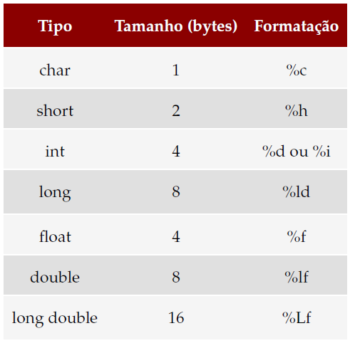

# Primeiro programa

Abra um editor de textos (`gedit`, por exemplo) e insira o seguinte trecho de código:

```c
#include<stdio.h>
/* Este é um comentário em bloco. 
Programa template para disciplina de lógica de programação
autor: Rafael <rafaeluft@gmail.com>

*/
int main(){
    //Este é um comentário de uma linha
    //CODIGO
    return 0;
}

```

Usaremos o template acima para nossos códigos, substituindo a parte `//CODIGO` pelos comandos necessários.  

Neste caso, se quisermos elaborar um código que exiba a mensagem "Hello world!" no terminal, usando o template acima, chegamos ao seguinte código: 

```c
#include<stdio.h>
/* Este é um comentário em bloco. 
Programa template para disciplina de lógica de programação
autor: Rafael <rafaeluft@gmail.com>

*/
int main(){
    //Este é um comentário de uma linha
    printf("Hello world!");
    return 0;
}

```


# Variáveis
Conforme tabela abaixo, podemos ver os tipos primitivos, seus respectivos tamanhos e formatação.



## Declarando, lendo e exibindo variáveis

Funções: 
* Exibição de dados: `printf` 
* Leitura de dados: `scanf`

Exemplo de declaração de variável, leitura de seu valor e escrita: 

```c
/* Ola, eu sou um comentario. Serei ignorado pelo compilador. */
#include<stdio.h>
int main(){ 
    int a = 10; float x = 10.0/3;
    printf("Ola eu tenho um inteiro para ser exibido: %d\n", a);
    printf("Ola eu espero o resultado de uma expressao: %d\n", (a+3)/2);
    printf("Podemos exibir varios dados. Por exemplo o float vai aqui: %f e o int aqui: %d\n", x, (a+3)*2);
    printf("Ou posso apenas exibir esta mensagem, sem variaveis ou expressoes.");
    return 0;
}
```

Exemplo de uso da scanf: 
```c
/* Exemplo de uso da scanf */
#include<stdio.h>
int main(){ 
    int a1 = 10, a2, a3, a4; float x = 10.0/3;
    printf("Digite quatro numeros inteiros seprados por virgula");
    scanf("%d, %d, %d, %d", &a1, &a2, &a3, &a4);
    printf("Digite quatro numeros inteiros seprados espaco");
    scanf("%d %d %d %d", &a1, &a2, &a3, &a4);
    return 0;
}
```
Além disso, as funções `scanf` e `printf` retornam um número inteiro informando a quantidade de elementos formatados corretamente. 

# Operadores aritméticos

operador | exemplo | forma contraída | explicação
------------ | -------------|------------ | -------------
`+` | `a = a+4;` | `a+=4;` | Soma 
`-` | `a = a-4;` | `a-=4;` | Subtração
/ | a = a/4; | a/=4; | Divisão
`*` | `a = a*4;` | `a*=4;` | Multiplicação
++ ou -- | a++; | --b;  | Incrementa ou decrementa em uma unidade
% | a = a % 2; | a%=2; | Resto da divisão 


# Conversão de tipos

O que acontece se eu fizer um inteiro igualar o valor de um float?

Os tipos podem ser convertidos via coerção (cast). Uma forma de deixar explícito é usar o nome do tipo entre parênteses. Observe o seguinte exemplo: 

```c
#include<stdio.h>
int main(){
    int a = (int)8.5/2; 
    int b = 11/2;
    float c = 11/2;
    float d = 11/2.0;
    float e = 11.0/2.0;
    float f = 11/(float)2;
    
    printf("a=%d, b=%d, c=%f, d=%f, e=%f, f=%f \n", a, b, c, d, e, f);
    return 0;
}
```
 Possivelmente informações serão perdidas. Imagine convertendo um double para um float!?

 # Lendo e exibindo strings

 As vezes é legal ler o nome. Teremos uma aula apenas para manipulação de strings. Por por enquanto, podemos ler e exibir estas strings. 

```c
char nome[128] = "Teste de string";
```

O comando acima declara uma string capaz de reter 128 caracteres (127 se contarmos o delimitador de final de string). Veja que só conseguiremos inicializar o conteúdo de uma string no momento de sua declaração. 

 ## Lendo e exibindo 1

```c
#include<stdio.h>
int main(){
    char nome[128];
    printf("Entre com o nome: ");
    scanf("%s", nome);
    printf("Nome=%s \n", nome);
    return 0;
}
```

 ## Lendo e exibindo 2

```c
#include<stdio.h>
int main(){
    char nome[128];
    printf("Entre com o nome: ");
    fgets(nome, 128, stdin);
    printf("Nome=%s", nome);
    printf("%s", nome);
    return 0;
}
```

Ler com espaço usando scanf: https://wiki.portugal-a-programar.pt/dev_geral:c:scanfparastrings 